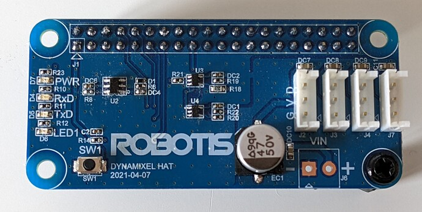

# Directory containing code for communication between Pi and OpenCM09.04

## Directory explenation

* OpenCM9.04: Directory containing Arduino files that run on microcontroller
* pi-mcu.py: Script containing basic code to control microcontroller
* raspberry.py: Script containing basic code to control the Dynamixel servos directly from the Pi. 
    **-> This is where the actual development is going on.**

## Raspberry.py

This is based on the follwoing [thread](https://community.robotis.us/t/rpi-driving-dynamixel-from-uart-at-1mbps/603) on the Robotis community forum. This [video](https://www.youtube.com/watch?v=7tzznz7f3sU) explains the proof-of-concept.
 

    
Robotis has been working on a Raspberry pi hat but for now it has only been available for beta testing.

### Hardware Setup

### Software Setup