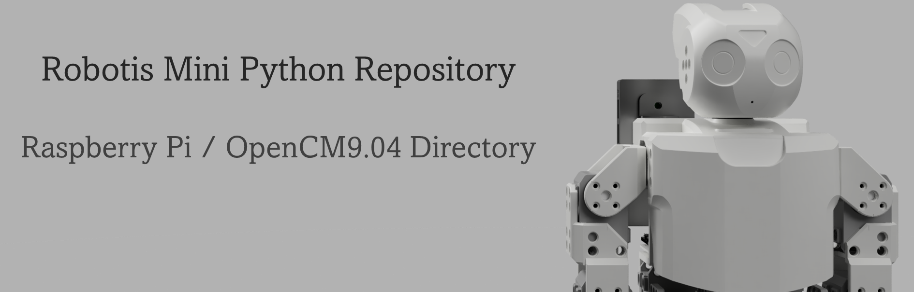
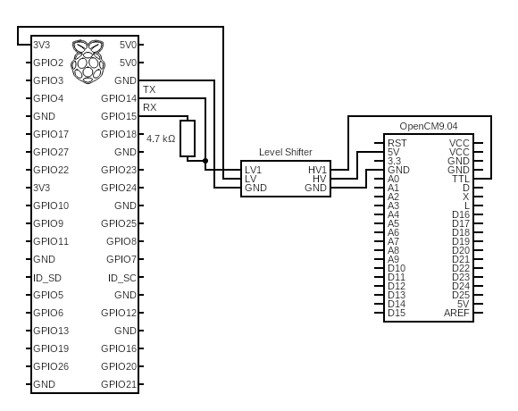
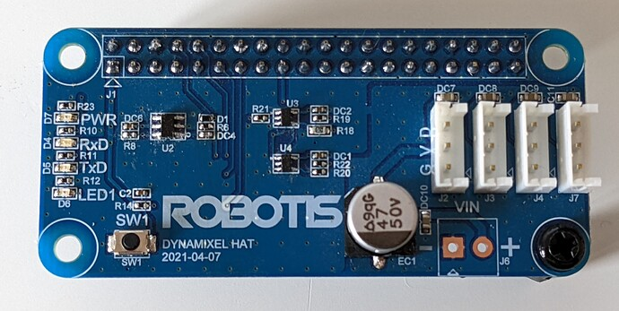

## Table of contents

- [Quick explanation](#quick-explanation)
- [Files & Folders explanation](#files--folders)
- [Hardware setup](#hardware-setup)
- [Software setup](#software-setup)


## Quick explanation

The Raspberry Pi Zero 2 is connected via it's UART to the TTL pin located on the OpenCM9.04
Because that TTL pin is directly connected to the data pin of the XL320's, no specific code has to be run on the OpenCM9.04. More info can be found in the [Hardware Setup](#hardware-setup).


## Files & Folders

| File/Folder | Description |
| :-: | :-: |
| _OLD | Folder containing old code. I keep it in case of. |
| blink | Folder containing a blink sketch for the OpenCM9.04. This is necessary to prevent the microcontroller to sleep after ~40 seconds. |
| mqtt.py | script in which I develop the code for communicating with the host pc over MQTT. 
| control.py | Script in which I develop code to control the XL320 servos using the Dynamixel SDK. 


## Hardware setup

The Hardware setup is based on the follwoing [thread](https://community.robotis.us/t/rpi-driving-dynamixel-from-uart-at-1mbps/603) on the Robotis community forum. This [video](https://www.youtube.com/watch?v=7tzznz7f3sU) explains the proof-of-concept. 

The only difference is that in the forum they put the resistor on the TX line but for me communication only worked with the resistor on the RX line...

As mentioned in the thread, you need to add these lines at the end of /boot/conf.txt on the Raspberry Pi:
```python
init_uart_clock=16000000
enable_uart=1
```

here you can see the basic circuit diagram: 



<br>

Robotis has been working on a Raspberry pi hat but for now it has only been available for beta testing :point_down: 




## Software setup

Just follow the Quick start guide in the main [README](../README.md#quick-start-guide) file, it's quite easy!


