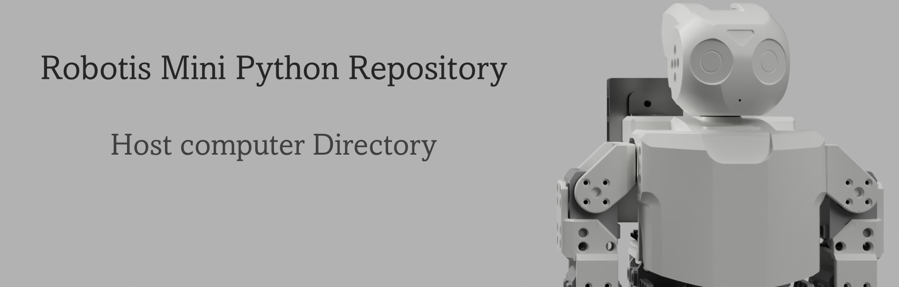

## Table of contents

- [Quick explanation](#quick-explanation)
- [Files & Folders explanation](#files--folders-explanation)

## Quick explanation

Here we focus on 3 things:
- Developing communication with the Raspberry Pi
- Developing virtual environment in which we have a virtual robot
- All major ***'brain-work'*** for the robot will happen on the Host

## Files & Folders explanation

| File/Folder | Description |
| :-: | :-: |
| klampt| Folder containing Klamp't library built from source. This is necessary to be able to use the Klamp't apps. Make sure to follow [these](https://github.com/krishauser/Klampt/blob/master/Cpp/docs/Tutorials/Install-Linux.md) instruction as explained in the main [README](../README.md#quick-start-guide) file. |
| robot| Folder containing all assets to create the virtual Mini. |
| terrains | Folder containing all assets to create the terrains in the virtual world. |
| basic_simulation.py | Testing script for simulation. |
| mini_control_virtual.py | Testing script for controlling the virtual robot. |
| mqtt.py | Script in which I develop the code for communicating with the Pi over MQTT. |
| world.xml | File containing the definition of all elements in the virtual world.| 
| all other files | are in heavy testing so they aren't important right now. |