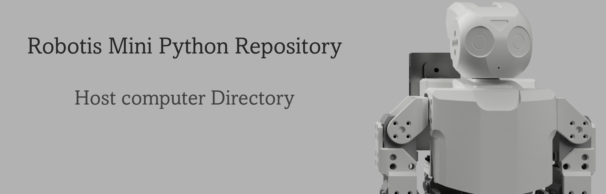

## Table of contents

- [a](#)
- [b](#)
- [c](#)
- [d](#)
- [e](#)

The OpenCM9.04 is not used to run code. It's only used to make the connection between the Pi and the servos easier.

**B.** Create a virtual environment in which I can test Inverse Kinematics, motion planning, etc

# Development using Klamp't Library

## Directory explenation

* klampt: Compiled library as explained [here](https://github.com/krishauser/Klampt/blob/master/Cpp/docs/Tutorials/Install-Linux.md). 
* robot: Directory containing all assets for Robotis Mini
* individual files
  * test_script.py
  * test_world.xml