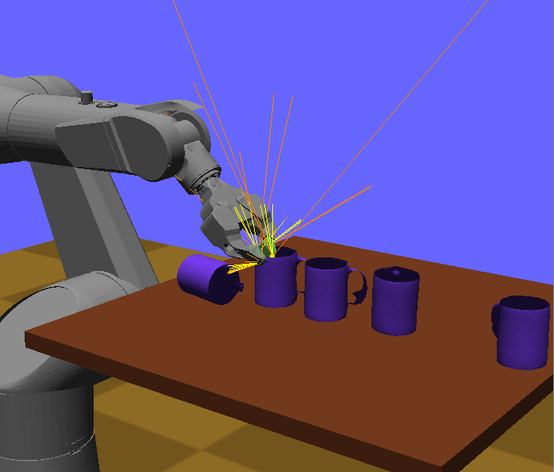
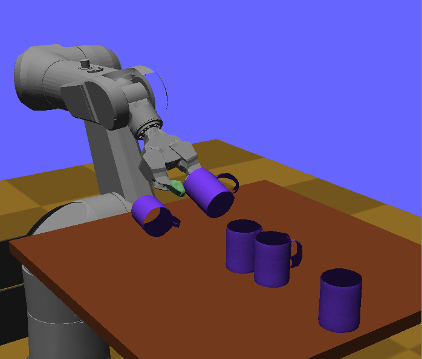
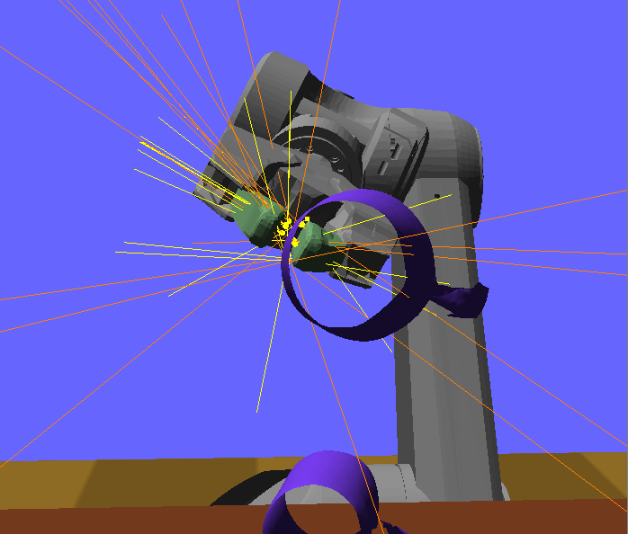
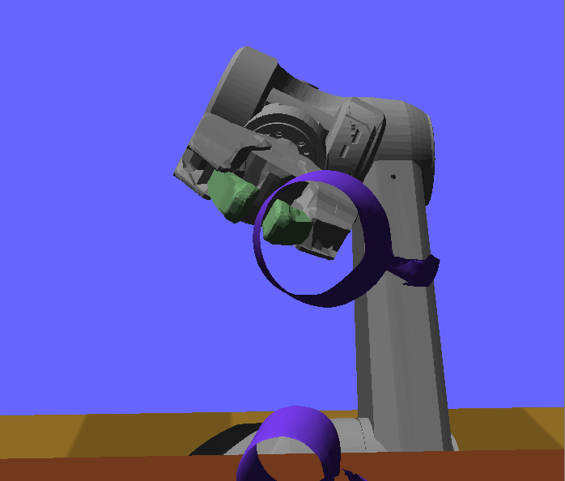

# Klamp't Manual: Simulation

* [Boundary-layer contact detection](#boundary-layer-contact-detection)
* [Collision response](#collision-response)
* [Actuator simulation](#actuator-simulation)

Simulation functionality in Klamp't is built on top of the Open Dynamics Engine (ODE) rigid body simulation package, but adds emulators for robot sensors and actuators, and features a robust contact handling mechanism. When designing new robots and scenarios, it is important to understand a few details about how Klamp't works in order to achieve realistic simulations.

## Boundary-layer contact detection

Other rigid body simulators tend to suffer from significant collision handling artifacts during mesh-mesh collision: objects will jitter rapidly, interpenetrate, or react to &quot;phantom&quot; collisions. The primary cause is that contact points, normals, and penetration depths are estimated incorrectly or inconsistently from step-to-step. Klamp't uses a new _boundary layer contact detection_ procedure that leads to accurate and consistent estimation of contact regions. Moreover, the boundary layer can simulate some limited compliance in the contact interface, such as soft rubber coatings or soft ground.

In Klamp't, contact is detected along the boundary layers rather than the underlying mesh. The thickness of the boundary layer is a simulation parameter called _padding_. Padding for each body can be set via the padding attribute in the&lt;simulation&gt;{&lt;robot&gt;,&lt;object&gt;,&lt;terrain&gt;}&lt;geometry&gt; XML element, with all bodies padded with 2.5mm by default. This allows it to handle thin-shell meshes as illustrated in the following figures.

 
The first step of Klamp't's collision handling routine is to compute all contacts between all pairs of geometric primitives within the padding range. This is somewhat slow when fine meshes are in contact. In order to reduce the number of contacts that must be handled by ODE, Klamp't then performs a clustering step to reduce the number of contacts to a manageable number. The maximum number of contacts between two pairs of bodies is given by the _maxContacts_ global parameter, which can be set as an attribute in the XML &lt;simulation&gt; tag.

For more details, please see: _K. Hauser. Robust Contact Generation for Robot Simulation with Unstructured Meshes. In proceedings of International Symposium of Robotics Research, 2013._

## Collision response

In addition to padding, each body also has coefficients of restitution, friction, stiffness, and damping (kRestitution, kFriction, kStiffness, and kDamping attributes in &lt;simulation&gt;{&lt;robot&gt;,&lt;object&gt;,&lt;terrain&gt;}&lt;geometry&gt; XML elements). The stiffness and damping coefficients can be set to non-infinite values to simulate softness in the boundary layer. When two bodies come into contact, their coefficients are blended using arithmetic mean for kRestitution, and harmonic means for kFriction, kStiffness, and kDamping.

The blending mechanism is convenient because only one set of parameters needs to be set for each body, rather than each pair of bodies, and is a reasonable approximation of most material types. Currently there is no functionality to specify custom properties between pairs of bodies.

## Actuator simulation
Klamp't handles actuators in one of two modes: PID control and torque control modes. It also simulates dry friction (stiction) and viscous friction (velocity-dependent friction) in joints using the dryFriction and viscousFriction parameters in .rob files. Actuator commands are converted to torques (if in PID mode), capped to torque limits, and then applied directly to the links. ODE then handles the friction terms.

In PID mode, the torque applied by the actuator is 

 &tau;=kP(&theta;D - &theta;A)+kD(&theta;'D - &theta;'A)+kII 

where
- kP, kI, and kD are the PID constants,
- &theta;D  and &theta;'D are the desired position and velocity,
- &theta;A  and &theta;'A are the actual position and velocity,
- and I is an integral error term.

The friction forces resist the motion of the joint, and Klamp't uses a simple stick-slip friction model where the sticking mode breaking force is equal to &mu;D
 and the sliding mode friction force is

-sgn(&theta;'A)(&mu;D+&mu;V|&theta;'A|). 

where &mu;V is the viscous friction force.  _Note: passive damping should be handled via the friction terms rather than the PID gain kD_.

Like all simulators, Klamp't does not perfectly simulate all of the physical phenomena affecting real robots. Some common phenomena include:

- Backlash in the gears.
- Back EMF.
- Angle-dependent torques in cable drives.
- Motor-induced inertial effects, which are significant particularly for highly geared motors. Can be approximated by adding a new motor link connected by an affine driver to its respective link.
- Velocity-dependent torque limits (e.g. power limits). Can be approximated in a controller by editing the robot's driver torque limits depending on velocity. Can be correctly implemented by adding a WorldSimulationHook or editing the ControlledRobotSimulator class.
- Motor overheating. Can be implemented manually by simulating heat production/dissipation as a differential equation dependent on actuator torques. May be implemented in a WorldSimulationHook.

