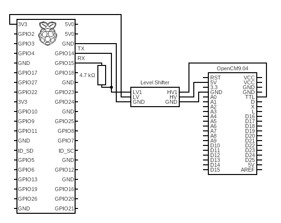

# Robotis_Mini_Python

## What's this project about?
This is a python only version of my Robotis_Mini_ROS project. 

I've had a lot of trouble with communication in the ROS version of this project so I decided to, once again, start from scratch. This time my goal is to make communication between the pi and the OpenCM9.04 rock-solid. In parallel I wil try out the Klamp't library which I've used for another project.

- My Robotis Mini ROS repository: [ROS repo](https://github.com/Benoit-LdL/Robotis_Mini_ROS).

- The Klamp't library [repo](https://github.com/krishauser/Klampt) and [docs](http://motion.cs.illinois.edu/software/klampt/latest/pyklampt_docs/Manual.html)

## What is the goal of this project?
**A.** Create a stable and fast connection between the Raspberry Pi and Dynamixel XL320 servos. 

this is the schematic for the connection between the raspberry Pi and the OpenCM9.04.
 
The OpenCM9.04 is not used to run code. It's only used to make the connection between the Pi and the servos easier.

--> Basic motion of XL320 servo using the raspberry.py script and following the above circuit diagram:

 

**B.** Create a virtual environment in which I can test Inverse Kinematics, motion planning, etc