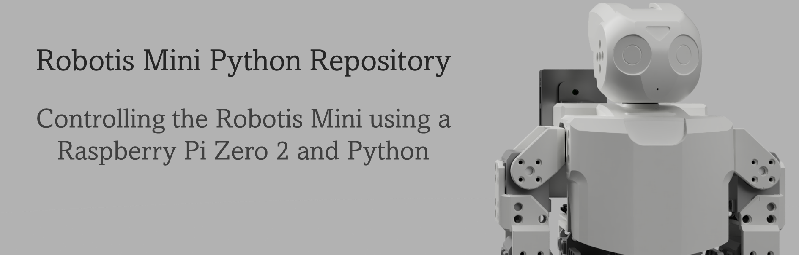

## Table of contents

- [What's the project about?](#whats-this-project-about)
- [What's the project goal?](#project-goal)
- [Repository layout](#repository-layout)
- [Quick start guide](#quick-start-guide)
- [Quick update check](#update-journal)
- [Check some visuals](#visuals)

## What's this project about?
In this repo I will try to do what I couldn't do in the previous iteration of my [Robotis Mini ROS](https://github.com/Benoit-LdL/Robotis_Mini_ROS) repository.

I've always been fascinated by robotics and especially humanoid robots and their movement. A few years ago, I wanted to buy a humanoid robot to try and learn more about the topic.

Instead of building one from scratch, I wanted to buy a kit so that I would loose to much time developing one from the ground up. (I also did not have the knowledge to develop one on my own)

While there are some options on the market (Like the [Robotis Darwin-OP](https://emanual.robotis.com/docs/en/platform/op3/introduction/) or the [Softbank / Aldebaran Nao](https://www.softbankrobotics.com/emea/en/nao)), they were way out of my budget (> €8.000). With a really small budget in mind, the only option was the [Robotis Mini]() from Robotis: 
- It was ***"relatively"*** cheap (~€450)
- It's from a reputable company
- Great documentation
- Big Open-Source community 

After a bit of research on how I would start with my project, I ended up learning about ROS and finding a [repository](https://github.com/roberto-martinmartin/robotis_mini) from [Roberto Martìn](https://robertomartinmartin.com/kuroki-machine-learning-robotis-mini/) that was working on a ROS-enabled Robotis Mini.

So the plan was to learn ROS and use it to control the Mini. [This](https://github.com/Benoit-LdL/Robotis_Mini_ROS) is my repository with the initial project using ROS.

I've had a lot of trouble with communication in the ROS version of this project so I decided to, once again, start from scratch. This time I'm ditching ROS and I will use Pyhton and the [Klamp't library](https://github.com/krishauser/Klampt) which I've used in a recent project and is, unlike ROS, not a pain in the *** to use. (I know ROS has a lot of potential but the learning curve was just a bit to much)

## Project Goal

1. Control XL320 servos with Raspberry Pi
2. Create a virtual environment in which I can control a Robotis Mini
3. Create a digital twin of the Mini:
    - communication between Host and Pi
    - communication between Pi and servos
4. Setup Inverse Kinematics to control the Mini

## Repository layout

The repository is devided in 2 parts:

### :point_right: [A.Robotis_Mini](A.Robotis_Mini/)

In this directory you will find all the code that has to run on the Raspberry Pi and openCM9.04.

Check it's [README](A.Robotis_Mini/README.md) file for more information.

### :point_right: [B.Host](B.Host/)

In this directory you will find all the code that has to run on the host computer.

Check it's [README](B.Host/README.md) file for more information.

## Quick start guide

### :point_right: [Setup for Robotis Mini](A.Robotis_Mini/)

#### :point_right: Setup for the Raspberry Pi

- Install latest version of Raspberry Pi OS on the Pi
- Install dependencies
    - Python3   (apt)
    - mosquitto && mosquitto-clients (apt)
    - paho-mqtt (pip)
    - Dynamixel SDK (check official instructions [here](https://emanual.robotis.com/docs/en/software/dynamixel/dynamixel_sdk/library_setup/python_linux/#building-the-library))
    - maybe more, run the scripts to see which packages are missing...

#### :point_right: Setup for the OpenCM9.04

While in theorie the OpenCM9.04 is only used as a pass-through board to connect the XL320 servos directly to the Raspberry Pi, we still need to flash a simple arduino sketch on it to prevent it from going into a kind of sleep mode after +- 40 seconds. 

* Install Arduino IDE
* Install the OpenCM9.04 board by following the official instructions [here](https://emanual.robotis.com/docs/en/parts/controller/opencm904/#arduino-ide)
* Flash the Arduino sketch located in the A.Robotis_mini direcotry of this repo onto the OpenCM9.04

### :point_right: [Setup for host computer](B.Host/)

* Install the Klamp't library from source, as explained [here](https://github.com/krishauser/Klampt/blob/master/Cpp/docs/Tutorials/Install-Linux.md#linux-from-source-recommended)
* Install dependencies
    - mosquitto-clients (apt)
    - paho-mqtt (pip)
    - maybe more, run the scripts to see which packages are missing...

## Update Journal

| Date | Description | Visual |
| :-: | :-: | :-: |
| 05/05/2022 |Basic motion of XL320 servo using the raspberry.py script and following the circuit diagram from the post below. (click to watch the video :point_right:) | 
| 03/05/2022 | After seeing [this post](https://community.robotis.us/t/rpi-driving-dynamixel-from-uart-at-1mbps/603) and getting the idea of using the Klamp't library gave me a motivation boost to get back to work. | N/A |
| 06/12/2021 | Trying to get the Dynamixel SDk working. | N/A |
| 24/11/2021 | Creation of Repository. | N/A |

## Visuals

### :point_right: Virtual

| 360° | Back  |
| :-: | :-: |
 | 

### :point_right: Real

| Front | Electronics Close-up |
| :-: | :-: |
 | 
